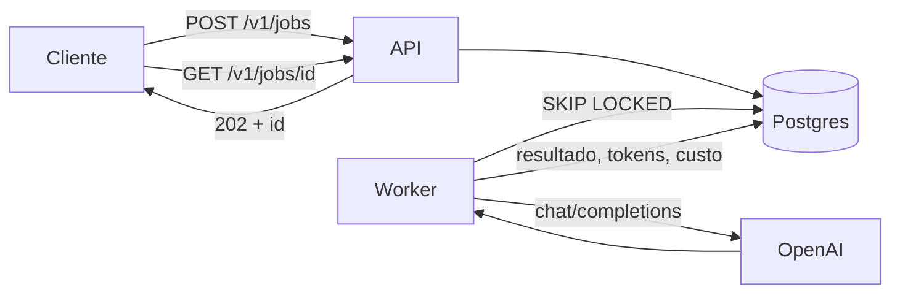

# InferQueue

Fila durável para processamento de texto por LLM. Aceita o pedido em milissegundos,
garante que ele será processado, e conta quanto custou.

---

## O problema

Chamar uma LLM dentro do ciclo de um request HTTP parece simples até entrar em produção:

- **A chamada leva segundos.** O cliente fica pendurado esperando, e um pico de tráfego
  vira timeout em cascata.
- **O provedor falha.** 429 por rate limit, 500 por instabilidade, conexão que cai no meio.
  Sem uma fila, o pedido do usuário simplesmente se perde, e ninguém fica sabendo por quê.
- **O mesmo texto é enviado mais de uma vez.** Um retry do cliente, um duplo clique, um
  reprocessamento em lote, e você paga duas vezes pela mesma resposta.
- **O custo é invisível.** Descobre-se quanto foi gasto quando a fatura chega, sem saber
  qual modelo ou qual parte do sistema consumiu.

O InferQueue resolve os quatro. O pedido entra numa fila persistida em Postgres e a API
responde na hora com um identificador. Um worker consome a fila, chama o modelo, e
registra resultado, tokens e custo. Se falhar, tenta de novo com espera crescente; se
esgotar as tentativas, o job vai para uma dead-letter com o motivo gravado, nada
desaparece em silêncio.

## Escopo

**O que está aqui:**

| | |
|---|---|
| Fila durável | Em Postgres, sobrevive a restart e deploy |
| Reserva concorrente | `FOR UPDATE SKIP LOCKED`, N workers sem pisar um no outro |
| Lease e recuperação | Worker que morre no meio não deixa job travado |
| Retry com backoff | Exponencial, com jitter, e distinção entre falha transitória e permanente |
| Dead-letter | Com endpoint para reenfileirar depois de corrigir a causa |
| Deduplicação | Por hash do conteúdo, à prova de requisições simultâneas |
| Custo por token | Tabela de preços em configuração, com relatório agregado |

**O que não está aqui, deliberadamente:** autenticação, multi-tenant, streaming de
resposta, interface web, pipeline de CI e deploy. O objetivo do projeto é a mecânica da
fila, não um produto completo.

## Como funciona



Estados de um job:

```
Pending ──reserva──> Processing ──sucesso──> Done
   ^                      │
   └───falha retentável───┤
                          └───tentativas esgotadas───> Dead ──POST /retry──> Pending
```

## Rodando

**Sem chave da OpenAI o sistema funciona.** Quando `Llm:ApiKey` está vazia, o worker usa um
cliente falso que devolve resposta simulada, dá para ver a fila, a reserva concorrente, o
retry e a contabilidade de ponta a ponta sem gastar nada.

### Tudo em contêiner

Requer apenas Docker.

```bash
docker compose up
```

Sobe o Postgres, espera ele aceitar conexão, aplica as migrations e só então levanta API e
worker. A API fica em `http://localhost:5051` e a documentação interativa em
`http://localhost:5051/scalar/v1`.

Para usar o modelo de verdade, copie `.env.example` para `.env` e preencha
`OPENAI_API_KEY`.

### Desenvolvimento, com a aplicação no host

Melhor para iterar: hot reload e debugger anexado. Requer .NET 10. Aqui só o banco sobe em
contêiner:

```bash
docker compose up -d postgres
```

O schema é criado por migration, não crie tabela na mão, ou o EF Core sai de sincronia:

```bash
dotnet tool install --global dotnet-ef
```

```bash
dotnet ef database update -p src/InferQueue.Infrastructure -s src/InferQueue.Api
```

Em dois terminais:

```bash
dotnet run --project src/InferQueue.Api
```

```bash
dotnet run --project src/InferQueue.Worker
```

Aqui a chave vai por user-secrets, que fica fora do repositório:

```bash
dotnet user-secrets set "Llm:ApiKey" "sk-..." --project src/InferQueue.Worker
```

## API

### Documentação interativa

Com a aplicação no ar, a especificação OpenAPI é gerada e servida por ela mesma:

| | |
|---|---|
| Interface para explorar e testar | http://localhost:5051/scalar/v1 |
| Especificação OpenAPI (JSON) | http://localhost:5051/openapi/v1.json |

A interface lista todos os endpoints, os schemas de request e response, e permite disparar
chamadas direto do navegador, não precisa de curl nem Postman para experimentar.

**Não é o Swagger UI.** A partir do .NET 9 a Microsoft removeu o Swashbuckle dos templates:
o pacote `Microsoft.AspNetCore.OpenApi` gera o documento OpenAPI, e a interface fica por
conta de outra biblioteca. Aqui é o [Scalar](https://github.com/scalar/scalar). O documento
em `/openapi/v1.json` é OpenAPI padrão, então serve em qualquer ferramenta que leia
OpenAPI, inclusive um Swagger UI apontado para ele, se você preferir a interface clássica.

**As duas rotas só existem em `Development`.** Em produção ficam desligadas, que é o
comportamento correto: não se expõe o mapa da API para o mundo sem motivo. Subindo por
`docker compose up`, o ambiente já vem como `Development` no compose. Rodando no host,
`dotnet run` usa o perfil `http` do `launchSettings.json`, que também define `Development`
e abre o navegador direto na documentação.

Se as duas rotas derem 404, é sinal de que a aplicação está rodando como `Production`.

### Endpoints

| Método | Rota | O que faz |
|---|---|---|
| `POST` | `/v1/jobs` | Enfileira. `202` com o id, ou `200` com o resultado se já existia |
| `GET` | `/v1/jobs/{id}` | Estado e resultado |
| `POST` | `/v1/jobs/{id}/retry` | Tira da dead-letter |
| `GET` | `/v1/usage?from=&to=` | Tokens e custo por modelo |
| `GET` | `/health` | Inclui checagem do banco |

```bash
curl -X POST http://localhost:5051/v1/jobs -H "Content-Type: application/json" -d '{"input":"O atendimento foi excelente."}'
```

Repetir a mesma chamada não cria job novo: a resposta traz o job existente com o header
`X-Job-Reused: true`.

Erros seguem `ProblemDetails` (RFC 9457).

## Decisões de engenharia

**A reserva é atômica, e a transação fecha antes da chamada ao modelo.** Um CTE seleciona
com `FOR UPDATE SKIP LOCKED` e já faz o `UPDATE ... RETURNING` na mesma instrução, não
existe janela entre ver o job e reservá-lo. `SKIP LOCKED` faz cada worker pular o que outro
já travou em vez de esperar; sem isso, N workers formam fila atrás do mesmo job e o
paralelismo vira zero. A transação fecha logo em seguida: segurar lock de banco durante
segundos de I/O de rede é o erro clássico desse tipo de sistema. Quem protege o job durante
o processamento é o lease.

**O lease é o que torna a falha recuperável.** Ao reservar, o worker marca até quando o job
é dele. Se o processo morrer, um reaper devolve à fila o que passou do prazo. É o
`visibility timeout` do SQS, feito na mão.

**`attempts` é incrementado na reserva, não na falha.** Um job que derruba o worker toda vez
gasta tentativas e acaba na dead-letter, em vez de matar o processo indefinidamente.

**Duas camadas de retry, com papéis distintos.** A camada HTTP absorve o soluço de segundos
sem devolver o job para a fila. A camada do job, com backoff persistido no banco, é a que
sobrevive à queda do processo. O jitter de ±20% evita que um lote inteiro rejeitado por 429
volte a bater no mesmo instante e mantenha o rate limit estourado.

**Nem toda falha merece retry.** 429, 5xx e falha de rede são transitórios. 400 e 401 não
são: insistir só gasta tentativa e atrasa a fila. Vão direto para a dead-letter.

**A deduplicação não confia na consulta prévia.** Buscar um job igual antes de inserir
resolve o caso comum, mas não a corrida entre duas requisições simultâneas. Quem resolve é
um índice único parcial sobre jobs em andamento: o insert perdedor vira exceção de domínio,
a API relê e devolve o vencedor. Verificado com 10 requisições concorrentes, uma linha
criada, o mesmo id nas dez respostas.

O índice é parcial de propósito. Uma versão anterior exigia unicidade sobre jobs
*concluídos* e estava errada: proibia reprocessar o mesmo texto meses depois. O invariante
correto é sobre trabalho em andamento, não sobre histórico.

**Custo desconhecido é nulo, não zero.** Modelo fora da tabela de preços não bloqueia o
processamento, mas o job fica com custo nulo e é contado à parte no relatório. Zero
desapareceria dentro de um `SUM` e faria o total parecer menor do que é.

**O tempo entra por `TimeProvider`.** Nada de `DateTime.Now` espalhado, é o que torna
backoff e expiração de lease testáveis sem esperar o relógio.

**As migrations são aplicadas por um _migration bundle_.** Um serviço do compose roda uma
vez, aplica o schema e sai; API e worker só sobem depois que ele termina com sucesso. O
bundle é um executável autocontido gerado no build, o que permite à imagem final não levar
nem o SDK nem o tooling do EF, ela roda sobre `runtime-deps`, só com as bibliotecas
nativas. A alternativa comum, chamar `Database.Migrate()` no startup da aplicação, faz
instâncias concorrentes disputarem a migração.

## Testes

```bash
dotnet test
```

36 testes. Os unitários cobrem o domínio puro, política de retry, transições de estado,
cálculo de custo, e rodam em milissegundos.

Os de integração sobem **Postgres real** via Testcontainers, na mesma imagem do
`docker-compose`, porque metade do que importa aqui não existe em banco de mentira: o
`SKIP LOCKED`, o índice único parcial, a agregação. O teste central roda **6 workers
concorrentes sobre 60 jobs** e verifica que nenhum id foi reservado duas vezes e nenhum job
ficou para trás. Precisa de Docker rodando.

Os testes montam o container de injeção de dependência pela mesma extensão que a aplicação
usa, então o registro dos serviços também fica coberto.

## Limitações conhecidas

- **O caminho de sucesso contra a API real da OpenAI não foi exercitado.** O cliente HTTP
  foi verificado nos ramos de erro (falha de rede, timeout, status não-transitório) e o
  pipeline inteiro roda com o cliente falso, mas a resposta de verdade nunca foi
  desserializada em teste.
- **Os preços em `appsettings.json` precisam ser conferidos** contra a página de pricing da
  OpenAI. São configuração, não código.
- **Não há testes de endpoint HTTP.** A camada é fina e foi verificada manualmente; se a API
  crescer, é o primeiro buraco a tapar.
- **Um worker processa os jobs de um lote em sequência.** O paralelismo vem de subir mais
  instâncias, não de disparar N chamadas dentro de uma.
